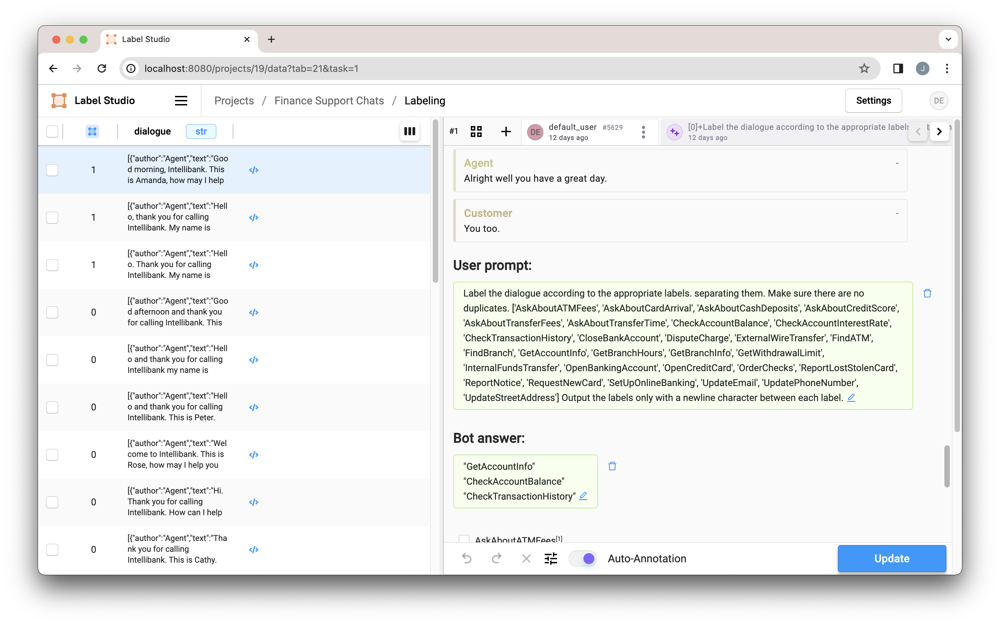

# Chatbot Prompter Workflow

This example notebook, "Customer Support Classification.ipynb," demonstrates setting up a comprehensive workflow for classifying customer support requests. It walks through the setup of a project that integrates with the [LLM Interactive](https://github.com/HumanSignal/label-studio-ml-backend/tree/master/label_studio_ml/examples/llm_interactive) ML Backend example to provide an LLM prompter as a predictor in the Label Studio UI. 

## Getting Started
To use this notebook:

- Clone this repository to your local machine.
- Start [Label Studio](https://labelstud.io/guide/quick_start)
- Start the [LLM Interactive ML Backend example](https://github.com/HumanSignal/label-studio-ml-backend/tree/master/label_studio_ml/examples/llm_interactive) (Make sure to configure your OpenAI API key)
- Run the "Customer Support Classification.ipynb" notebook in Jupyter.
- Connect the created project to the ML Backend as described [here](https://github.com/HumanSignal/label-studio-ml-backend/tree/master/label_studio_ml/examples/llm_interactive). Make sure to enable "Use for interactive preannotations." 