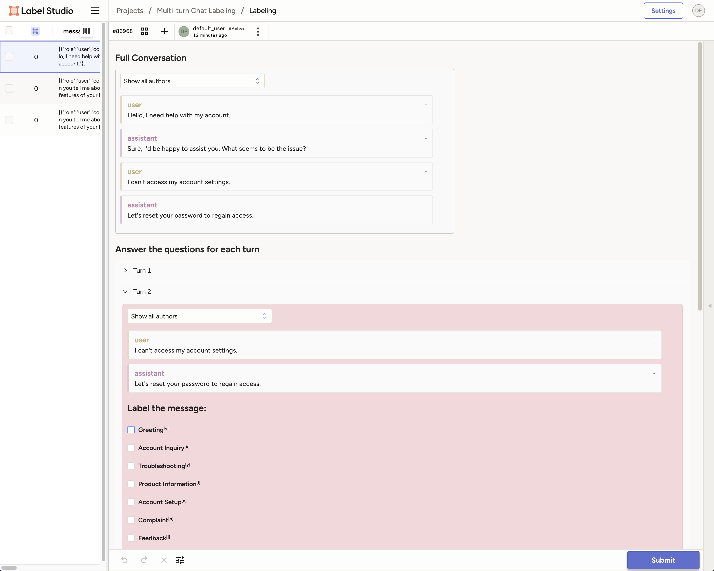

# Multi-turn Chat Labeling

This example demonstrates how to label multi-turn chat conversations using Label Studio.



## Requirements

- Label Studio
- Python 3.8+
- Label Studio SDK

## Installation

```bash
pip install -r requirements.txt
```

## Usage

The [Multi-turn Labeling.ipynb](Multi-turn%20Labeling.ipynb) notebook contains the code to create the project, import the tasks into the project, and then label the tasks in Label Studio.

