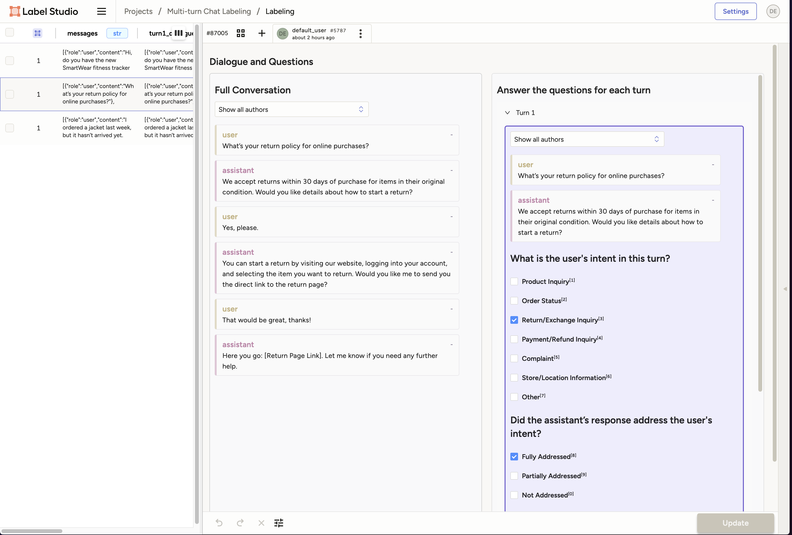

# Multi-turn Chat Labeling: Evaluating Virtual Assistant Conversations

This example demonstrates how to systematically evaluate multi-turn chat conversations using Label Studio. By analyzing real conversations with human feedback, you can improve your virtual assistant's performance and user experience.



## What You Can Learn
- Identify common user intents and conversation patterns
- Measure how effectively your assistant addresses user needs
- Spot gaps in understanding or response quality
- Track conversation flow and intent transitions
- Find opportunities to improve responses

## Key Features
- Intuitive labeling interface for conversation analysis
- Comprehensive evaluation metrics:
  - User intent classification
  - Response accuracy and helpfulness
  - Success in addressing user needs
  - Required follow-up actions
- Conversation flow analysis:
  - Intent transitions
  - Topic consistency
  - Common conversation patterns

## Requirements
- Label Studio instance
- Label Studio SDK (`pip install label-studio-sdk`)
- Python 3.8+ with pandas

## Getting Started

1. Install dependencies:
```bash
pip install -r requirements.txt
```

2. Follow the [Evaluating Virtual Assistant Conversations.ipynb](Evaluating%20Virtual%20Assistant%20Conversations.ipynb) notebook to:
   - Set up your Label Studio project
   - Import conversation data
   - Create a labeling interface
   - Analyze labeling results
   - Generate insights for improvement

## Customization
- Use your own conversation data (sample data provided)
- Modify labeling questions for your use case
- Adjust the maximum conversation turns
- Add custom metrics and analyses

