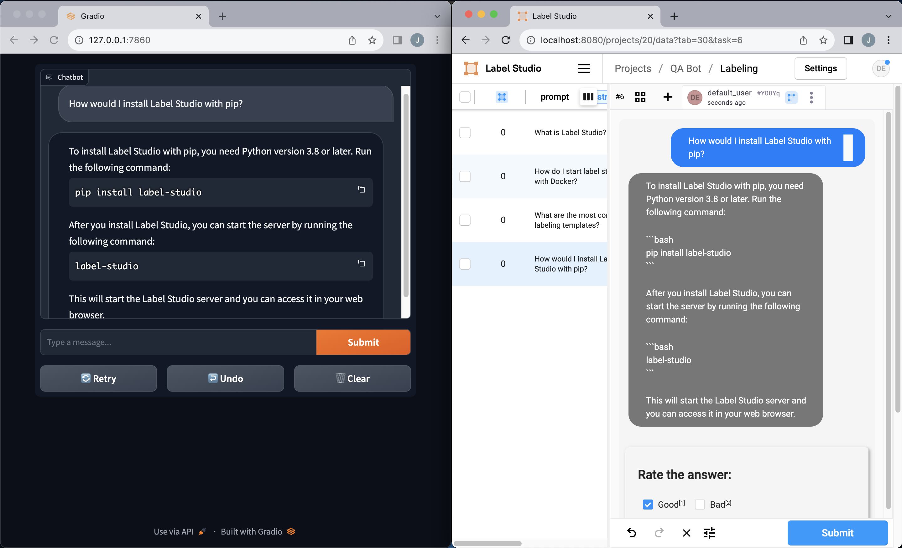

# Label Studio as Feedback Mechanism for QA System

This project demonstrates how to utilize Label Studio as a feedback mechanism
to incorporate human input into a Question-Answering (QA) system. The provided
example extracts the documentation from the Label Studio repository and uses
those documents to serve the QA system. 

For more details, consult [From Foundation Models to Fine-Tuned Applications
Using Label Studio](https://labelstud.io/blog/from-foundation-models-to-fine-tuned-applications-using-label-studio)
on the Label Studio blog.

<p align="center">
	
</p>

## Code Overview

1. **build_doc_db.py**: A script to clone the Label Studio documentation, split
the markdown files into chunks, and prepare them for the QA system by
generating embeddings.

2. **label_studio_callback_handler.py**: A handler that integrates with
LangChain's callback mechanism. This handler sends data to Label Studio
whenever a QA operation is executed.

3. **chatbot.py**: Incorporates the LabelStudioCallbackHandler into the QA
system, initializes the QA chain, and provides a chat interface using Gradio.
The **simple_chatbot.py** and **advanced_chatbot.py** demonstrate a chatbot
without RAG or feedback, and a chatbot with RAG only.

4. **add_documents.py**: A script to extract examples labeled 'good'
from a JSONL file exported from Label Studio and add them to an existing vector
database.

## Running the Example

1. Clone this repository. 

2. Ensure you have the required libraries installed:
```bash
pip install -r requirements.txt
```

Having troubles installing with pip? It might be because your platform isn't
compatible with the latest version of Label Studio (you will need at a minimum
1.9.0). To workaround this, we suggest [installing Label Studio with
Docker](https://labelstud.io/guide/install.html#Install-with-Docker), removing
the Label Studio dependency in requirements.txt, and running the `pip install`
command again. As another alternative, you can also run [Label Studio in
Hugging Face Spaces](https://huggingface.co/new-space?template=LabelStudio/LabelStudio).
Details about Label Studio in Hugging Face can be found in this [blog post](https://labelstud.io/blog/introduction-to-label-studio-in-hugging-face-spaces/).

4. Set your OpenAI API key as an environment variable. If you don't have one,
you can [create one here](https://platform.openai.com/account/api-keys). 

```bash
export OPENAI_API_KEY='your_api_key_here'
```

5. Start Label Studio. 

```bash
label-studio start
```

6. Create a new project in Label Studio with the following config. 

```xml
<View>
    <Style>
        .chat-container {
        display: flex;
        flex-direction: column;
        padding: 10px;
        background-color: #F5F5F5;
        border-radius: 10px;
        }

        /* Styles for the chat bubbles */
        .chat-bubble {
        padding: 10px 20px;
        margin: 5px;
        border-radius: 20px;
        line-height: 1.5;
        color: white;
        max-width: 80%;
        word-wrap: break-word;
        }

        /* Styles specific to the user */
        .user {
        align-self: flex-end;
        background-color: #007BFF;
        }

        /* Styles specific to the bot */
        .bot {
        align-self: flex-start;
        background-color: #777;
        }
    </Style>
    <View className="chat-container">
        <View className="chat-bubble user">
            <Text name="prompt" value="$prompt"/>
        </View>
        <View className="chat-bubble bot">
            <Text name="response" value="$response"/>
        </View>
        <View style="box-shadow: 2px 2px 5px #999; padding: 20px; margin-top: 2em; border-radius: 5px;">
            <Header value="Rate the answer:"/>
            <Choices name="rating" toName="response" choice="single" showInLine="true">

                <Choice value="Good"/>
                <Choice value="Bad"/>
            </Choices>
        </View>
    </View>
</View>
```

6. [Create a new Label Studio API key](https://labelstud.io/guide/api.html) and
set the appropriate environment variables.

```bash
export LABEL_STUDIO_API_KEY='your_api_key_here'
```

## Running the Example

1. **Prepare the Data**: This will clone the Label Studio repo, split the
markdown files, and generate embeddings.

```bash
python build_doc_db.py 
```

```bash
# Available parameters
python data_preparation_script.py \
    --repo_path YOUR_OUTPUT_REPO_PATH \
    --repo_url YOUR_REPO_URL \
    --persist_directory VECTORDB_PERSIST_DIRECTORY
```

2. **Launch the QA System with Label Studio Feedback Mechanism**: This script
will start a chat interface where you can interact with the QA system. Feedback
from the QA system will be sent to Label Studio for potential human review, and
we can view it when we click the refresh button. 

```bash
python chatbot.py --project_id 20
```
Note: The `project_id` number should match your project in Label Studio (e.g.
for `http://localhost:8080/projects/20/`, the project number would be `20`)

3. **Annotate and Export Data from Label Studio**: After we have annotated our
data with Label Studio, we can export it as a JSON file. 

4. **Incorporate 'Good' Examples into our Vectordb**: Run the script to extract
'good' labeled examples from your JSONL file and add them to the vector
database:

```bash
python add_documents.py \
    --json_path PATH_TO_YOUR_JSON_FILE \
    --persist_dir VECTORDB_PERSIST_DIRECTORY
```

5. **Restart the QA System**: By restarting the QA system, with our updated
vectors, our labeled documents will be incorporated in the retrieval task. 

## Understanding the Code

The QA system uses embeddings to retrieve relevant documentation sections for
each user query. The embeddings are prepared from the Label Studio
documentation and persisted in the directory specified by the user. When the QA
system generates a response, this response is also sent to Label Studio for
potential review, where corrections can be made.

## Notes

- The chat interface provided uses Gradio.
  
- In the QA chain, the `return_source_documents=True` flag is set, although
  it's noted that it might not be working as expected.

- Make sure that your Label Studio instance is running and accessible through
  the specified URL before starting the ChatBot. 

- Ensure that the `LABEL_STUDIO_API_KEY` and `OPENAI_API_KEY` are set to valid
  values corresponding to your Label Studio instance and OpenAI account.
