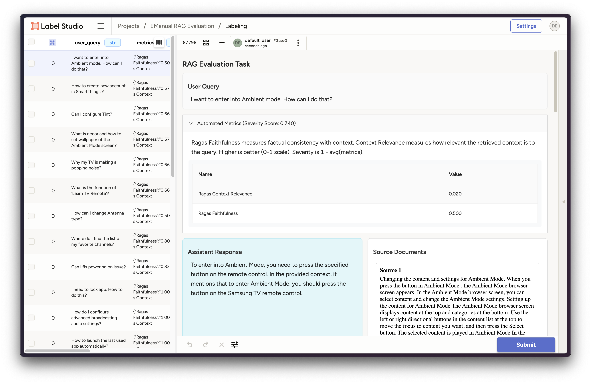

# RAG QA Review

This example demonstrates how to use Label Studio to review and evaluate the outputs of a Retrieval-Augmented Generation (RAG) system.

It leverages the [RAGBench dataset](https://huggingface.co/datasets/rungalileo/ragbench) (specifically the `emanual` subset, containing questions and answers based on consumer electronics manuals) and the [RAGAS](https://github.com/explodinggradients/ragas) framework for automated evaluation metrics.

## Workflow

The core workflow implemented in the accompanying Jupyter Notebook ([`RAG_Review.ipynb`](./RAG_QA_Review.ipynb)) is as follows:

1.  **Load Data**: Loads the RAGBench `emanual` test dataset, which includes questions, generated responses, retrieved source documents, and pre-computed RAGAS metrics (faithfulness, context relevance).
2.  **Identify Critical Samples**: Filters the dataset to find samples where the RAG system performed poorly, based on configurable thresholds for RAGAS `faithfulness` and `context_relevance`.
A `severity_score` is calculated to prioritize the most problematic examples.
3.  **Format for Label Studio**: Transforms the critical samples into a JSON format suitable for Label Studio import. This includes:
    *   Structuring the data with fields like `user_query`, `assistant_response`, etc.
    *   Formatting the source documents and RAGAS metrics using HTML for clear presentation in the Label Studio UI.
4.  **Define Labeling Interface**: Creates a custom Label Studio labeling configuration (`label_config`) tailored for RAG evaluation. This interface allows reviewers to assess:
    *   Response Quality (Accuracy, Completeness)
    *   Context Evaluation (Source Coverage, Missing Information)
    *   Agreement with Automated Metrics
5.  **Import to Label Studio**: Uses the `label-studio-sdk` to:
    *   Connect to a running Label Studio instance.
    *   Create a new project with the custom labeling interface.
    *   Import the formatted review tasks into the project.

## Label Studio Interface

The notebook sets up a Label Studio project that looks like this:



## Running the Example

1.  **Prerequisites**:
    *   Python 3.x
    *   A running instance of Label Studio accessible via a URL.
    *   An API key for your Label Studio user account.
2.  **Install Dependencies**:
    ```bash
    pip install -r requirements.txt
    ```
3.  **Configure Label Studio Connection**:
    *   Open the [`RAG_Review.ipynb`](./RAG_QA_Review.ipynb) notebook.
    *   Locate the cell defining `LABEL_STUDIO_URL` and `LABEL_STUDIO_API_KEY`.
    *   Update these variables with your Label Studio instance URL and API key.
4.  **Run the Notebook**: Execute the cells in the Jupyter Notebook sequentially.

This will load the data, identify critical samples, and create a new project in your Label Studio instance populated with tasks ready for review.
