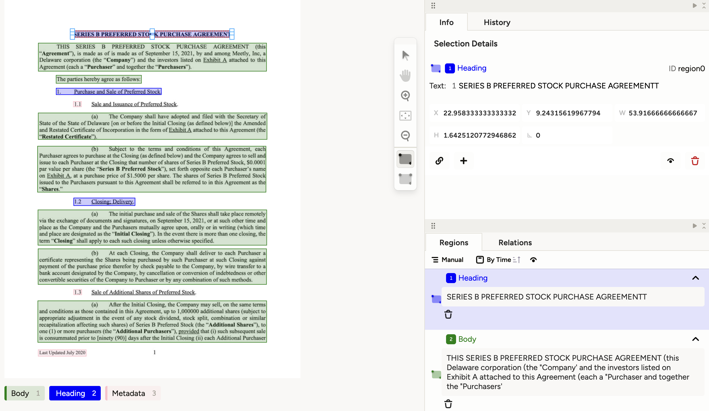

# Using Label Studio to Evaluate Smol Docling 
[Label Studio](labelstud.io) allows you to evaluate and correct Smol Doclling 



In this project, we'll help you set up a new Label Studio project, 
upload a multi-page pdf (converted to images), and then we'll use 
the Smol Docling model to run OCR over that document and upload the results to 
Label Studio for easy evaluation. You can label the bounding boxes provided by SmolDocling with whatever values you provide in the `<Label>` section for easy classification! 

## Prerequisites 
You'll need to have the following to run this repo: 
1. Label Studio running, with an account that you can get the token for. 
  To install Label Studio, simply run:
  ```
  pip install label-studio
  ```
2.  Jupyter notebook installed on your machine. 

## Getting Started 
1. Copy this repo to your local machine 
2. Open `SmolDocling-LabelStudio-example.ipynb` in Jupyter Notebook (or your favorite notebook running system)
3. Run the first cell to install all necessary packages. 
4. In the second cell, fill in your API keys and URLs
5. Run the following cells in order to create your project in your Label Studio instance, 
upload a sample task, run SmolDocling over that sample task, and upload the results to Label Studio.

## What now? 
To evaluate SmolDocling, we reccomend comparing the text of the document with the text provided by the model. You can also label the individual bounding boxes with custom labels (as specified by the `<Label>` tag at the top of the Labeling Config) to classify or give metadata to your bounding boxes that are generated by SmolDocling. 

Both the bounding boxes themselves and the textarea tags within them are editable, so you can make any and all necessary changes. You can then pull the data from Label Studio and run metrics to get a sense of how often the documents you use need to be edited. 

You can also add other types of control tags to this project. For instance, a rating field could be useful to get 
an overall judgement of how well the model performed. 
